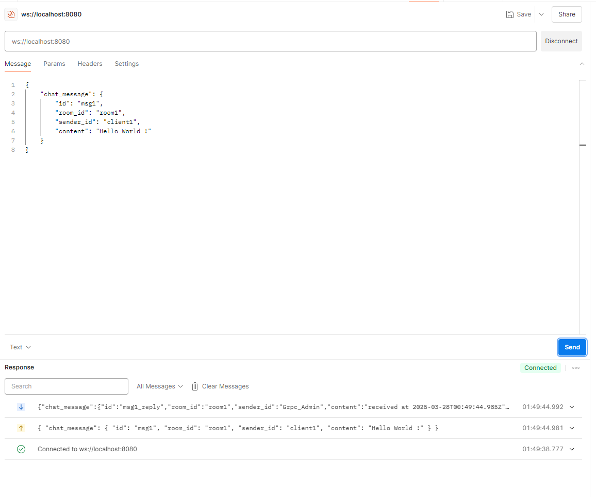
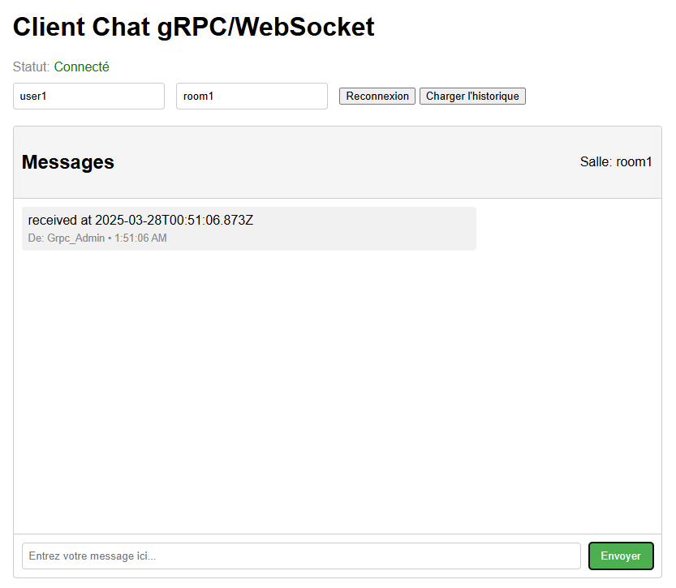

# Reverse Proxy WebSocket avec microservice gRPC

Ce projet implémente un service de chat simplifié utilisant gRPC comme backend et un reverse proxy WebSocket pour permettre aux clients web de communiquer avec le service.

## Objectifs

Ce projet a été développé pour se familiariser avec:
- La définition d'un service gRPC via un fichier `.proto`
- La création d'un serveur gRPC en Node.js
- La mise en place d'un reverse proxy WebSocket qui communique avec le serveur gRPC

## Technologies utilisées

- Node.js
- Protocol Buffers (protobuf)
- gRPC (`@grpc/grpc-js`, `@grpc/proto-loader`)
- WebSocket (`ws`)

## Architecture du projet

L'architecture du projet se compose de trois parties principales:

1. **Serveur gRPC**: Implémente la logique métier du service de chat, y compris la gestion des utilisateurs et des messages.
2. **Reverse Proxy WebSocket**: Sert de pont entre les clients web et le serveur gRPC, traduisant les messages WebSocket en appels gRPC.
3. **Client Web**: Interface utilisateur HTML/JS permettant d'interagir avec le service de chat via WebSocket.

## Structure des fichiers

```
grpc-ws-reverse-proxy/
├── chat.proto       # Définition des services gRPC et des messages
├── server.js        # Implémentation du serveur gRPC
├── proxy.js         # Implémentation du reverse proxy WebSocket
├── client.html      # Interface utilisateur web
└── package.json     # Dépendances du projet
```

## Fonctionnalités

- Communication en temps réel via WebSocket
- Service gRPC avec streaming bidirectionnel
- Historique des messages par salle de chat
- Interface utilisateur web pour tester le service

## Installation

1. Clonez le dépôt:
```bash
git clone https://github.com/AymenMB/Reverse-Proxy-WebSocket-avec-microservice-gRPC.git
cd Reverse-Proxy-WebSocket-avec-microservice-gRPC
```

2. Installez les dépendances:
```bash
npm install
```

## Démarrage du projet

1. Lancez le serveur gRPC:
```bash
node server.js
```
Vous devriez voir un message indiquant que le serveur gRPC est en écoute sur `0.0.0.0:50051`.

2. Dans un autre terminal, lancez le reverse proxy WebSocket:
```bash
node proxy.js
```
Un message vous confirmera que le proxy est en écoute sur `ws://localhost:8080`.

3. Ouvrez le fichier `client.html` dans votre navigateur pour accéder à l'interface utilisateur web.

## Test avec Postman

Vous pouvez également tester le service avec Postman:

1. Ouvrez Postman et créez une nouvelle requête WebSocket.
2. Connectez-vous à l'URL: `ws://localhost:8080`.
3. Envoyez un message JSON en respectant le schéma ChatStream. Par exemple:

```json
{
    "chat_message": {
        "id": "msg1",
        "room_id": "room1",
        "sender_id": "client1",
        "content": "Hello World!"
    }
}
```

Voici un exemple de test avec Postman:



## Interface Web

Une interface web simple permet de tester le service de chat:



## Fonctionnalités implémentées

### Historique des messages

Une fonctionnalité d'historique des messages a été ajoutée au service gRPC:

- Nouvelle méthode `GetChatHistory` dans le fichier proto
- Stockage des messages en mémoire côté serveur
- Possibilité de récupérer les messages par salle de chat
- Limite paramétrable du nombre de messages à récupérer

### Client Web

Un client web simple a été développé pour tester le service:

- Interface utilisateur conviviale
- Connexion WebSocket au proxy
- Envoi et réception de messages en temps réel
- Affichage de l'historique des messages

## Développement

### Définition du service gRPC

Le fichier `chat.proto` définit les structures de données et les services gRPC:

```proto
syntax = "proto3";
package chat;

// Définition des services
service ChatService {
    rpc GetUser(GetUserRequest) returns (GetUserResponse);
    rpc Chat(stream ChatStream) returns (stream ChatStream);
    rpc GetChatHistory(GetChatHistoryRequest) returns (GetChatHistoryResponse);
}
```

### Structure du message de chat

```proto
message ChatMessage {
    string id = 1;
    string room_id = 2;
    string sender_id = 3;
    string content = 4;
    string timestamp = 5;
}
```

## Licence

MIT

## Auteur

Aymen MB